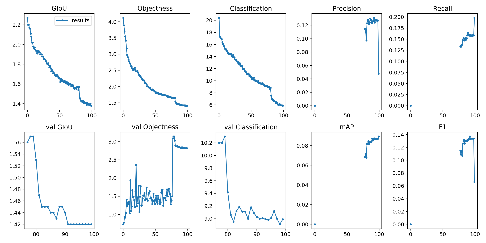

# Slim TinyYOLO

## DATASET
The VisDrone 2019 Object Detection (Zhu et al. 2019) in Video Challenge requires participating
algorithms to predict the bounding boxes with real-valued confidences of each object class in
each video frames. We have taken 12 categories: ignored, pedestrian, person, car, van, bus, truck,
motor, bicycle, tricycle, tricycle. The challenge provides 96 challenging sequences, including 56
video sequences for training (24,201 frames in total), 7 sequences for validation (2,819 frames in
total) and 33 sequences for testing (12,968 frames in total).

## TRAINING
- ### Step 1: Normal Training
We trained the Slim YOLO model on VisDrone 2019 challenge dataset for around 10,000
epochs. The validation dataset included as part of the dataset was used.  
Results obtained on 416x416 images for upto 10,000 iterations on VisDrone 2019 Validation
dataset using YoloV3 spp3 configuration:  
Detections Count = 262846, Unique Truth Count = 40169 
Class ID = 0, name = ignored, ap = 0.12% (TP = 0, FP = 2) 
Class ID = 1, name = pedestrian, ap = 13.25% (TP = 1521, FP = 2925) 
Class ID = 2, name = people, ap = 15.23% (TP = 792, FP = 1287) 
Class ID = 3, name = bicycle, ap = 2.12% (TP = 28, FP = 176) 
Class ID = 4, name = car, ap = 64.26% (TP = 8224, FP = 2557) 
Class ID = 5, name = van, ap = 31.90% (TP = 627, FP = 716) 
Class ID = 6, name = truck, ap = 15.09% (TP = 90, FP = 99) 
Class ID = 7, name = tricycle, ap = 11.40% (TP = 37, FP = 16) 
Class ID = 8, name = awning-tricycle, ap = 6.08% (TP = 8, FP = 24) 
Class ID = 9, name = bus, ap = 31.54% (TP = 60, FP = 22) 
Class ID = 10, name = motor, ap = 17.21% (TP = 771, FP = 1109) 
Class ID = 11, name = others, ap = 2.04% (TP = 0, FP = 0) 
For Confidence Threshold = 0.25, precision = 0.58, recall = 0.30,F1-score = 0.40 
For Confidence Threshold = 0.25, TP = 12158, FP = 8933, FN = 28011, average IoU = 42.43 % 
IoU threshold = 50 %, used Area-Under-Curve for each unique Recall 
mean average precision (mAP@0.50) = 0.175191, or 17.52 % 
Total Detection Time: 95.000000 Seconds 

- ### Step 2: Sparsity Training
Now, we perform sparse training on the same dataset, taking batch size of 4, as shown in Figure below.

Figure: Batch for Sparsity Training

Sparsity training of 100 epochs completed in 60.749 hours on GTX 960M.

Figure: Sparsity Training completed

Results obtained from sparsity training are shown in below figure.

Figure: Results obtained from sparsity training

- ### Step 3: Channel Pruning
Results obtained after keeping pruning ratio 0.5 and inter layer ratio 0.1 are shown in below Figure.

Figure: Results obtained from Channel Pruning

- ### Step 4: Fine Tuning
Now, we trained the pruned model again to fine-tune the weights, taking batch size of 8, as shown in below figure.

We performed finetuning for 100 epochs, taking 45.428 hours on a GTX 960M. It is shown in below figure.

Figure: Fine tuning for 100 epochs

## EVALUATION AND RESULTS
We obtained a MAP value of almost 10 at 50% IoU threshold. Results obtained are shown in below figure.

## TEST 
